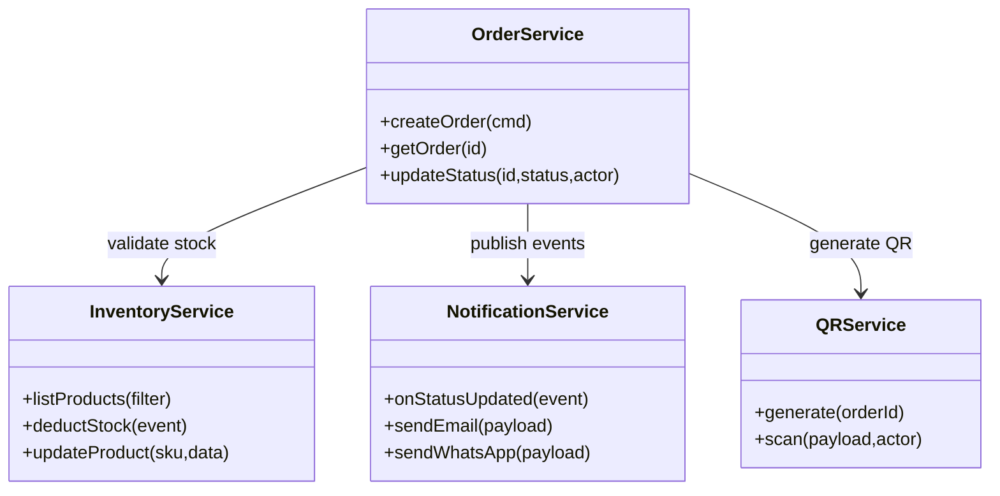
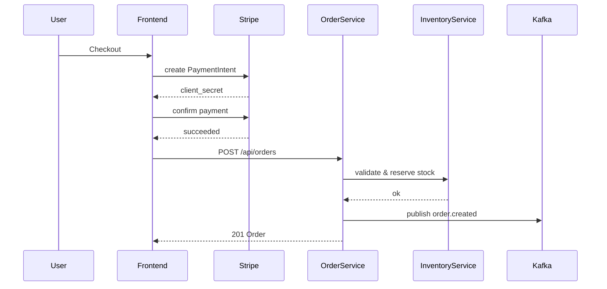
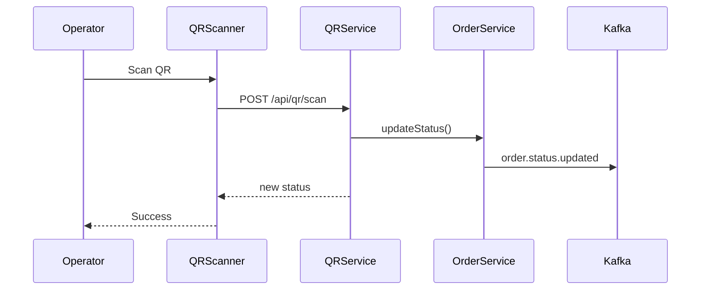

# Onestitches

SAAS for digitized embroidered clothing.

## Product Overview
- **Product Name:** Digitized Embroidered Clothing Platform
- **Version:** MVP-1.0
- **Summary:** Two-sided platform with Customer Portal (e-commerce, customization, payment, tracking) and Admin/Factory Portal (order ops, QR workflows, inventory, notifications, analytics).
- **Target Users:** D2C shoppers, CSRs, factory operators, supervisors, system administrators.
- **Goals:** online customization & tracking, QR-driven factory updates, automated communications, actionable analytics.
- **Success Metrics:** checkout conversion ≥2.5%, payment success ≥95%, lead time −25%, WebSocket latency p95 <2s.

## High-Level Design
- **UI/Frontend:** Next.js 14 (React 18, TypeScript, Tailwind), Zustand/React Query for state, STOMP client, Stripe Elements, ZXing QR scanner.
- **API/Backend:** Java 17 Spring Boot 3 application with modular packages (`order`, `inventory`, `notification`, `qr`, `realtime`). Kafka for events, Redis for cache/idempotency.
- **Database/Storage:** MongoDB 7 collections (`orders`, `products`, `customers`, `notification_logs`); GridFS/S3 for artwork & QR images.
- **AuthN/Z:** Spring Security (JWT for customers, OAuth2/OIDC for admins) with role-based guards and audit logging.
- **Integrations:** Stripe Payment Intents, WhatsApp Business API, SMTP, ZXing, WebSocket/STOMP.
- **Observability:** OpenTelemetry metrics/traces, structured JSON logs, Prometheus/Grafana, ELK stack, alerts via Slack/Email.

### Current Progress
- Backend exposes `GET /api/inventory/products` with stubbed data.
- Frontend home page fetches and lists products from the inventory API with simple category filters.
- Backend exposes `GET /api/inventory/products/{sku}` for product details.
- Frontend product detail page displays product info with a hover zoom image and shows category.
- Added `ArtworkUploader` component with client-side validation; backend presign and upload endpoints support single-use uploads.
- Implemented pre-signed upload flow with 2D overlay preview and cart state persistence.
- Implemented `POST /api/orders` endpoint with idempotent order creation backed by payment intent verification.

### Data Flows
- **Catalog Browse:** Frontend → `GET /api/inventory/products?category=apparel` → query stubbed catalog → response.
- **Customization Upload:** FE validates file → pre-signed URL → upload to S3/GridFS → preview client-side.
- **Checkout & Payments:** FE confirms Stripe PaymentIntent → `POST /api/orders` → inventory check + persist → publish `order.created` → generate QR → 201.
- **Real-time Tracking:** Client subscribes `/topic/order/{id}` → `order.status.updated` fan-out via WebSocket; reconnect fetches latest via REST.
- **Admin Order Update:** Admin → `POST /api/orders/{id}/status` → state machine validate → persist → emit event → audit log.
- **QR Scan:** Scanner posts to `/api/qr/scan` → validate code + role → update status → event.
- **Inventory Deduction:** `order.created` consumer decrements stock; if below threshold publish `inventory.low`.
- **Notifications:** `order.status.updated` consumer renders template → send Email/WhatsApp → log outcomes with retry/backoff.

### Cross-Cutting Concerns
- **Performance:** Redis caching, Mongo indexes, pagination, CDN for media.
- **Security:** HTTPS, JWT/OIDC, field-level encryption, Vault secrets, CSRF/CORS controls, rate limiting, input validation.
- **Compliance:** PCI SAQ-A, GDPR/DPDP (24-mo retention, erasure flow), WhatsApp/Email policy adherence.
- **Resiliency:** Retry/backoff, circuit breakers, idempotency keys, graceful WebSocket degradation.
- **Auditing:** All admin/order changes logged with actor, timestamp, before/after snapshot.

## Build & Test

Use Gradle to build and test both backend and frontend:

```bash
gradle build
```

The repository uses a single root `build.gradle` that configures all modules. Running this command triggers the Next.js production build for the frontend and executes the Spring Boot tests for the backend modules.

If you prefer to use the Gradle wrapper, generate its supporting JAR once after cloning:

```bash
gradle wrapper --console=plain
```

The `gradle/wrapper/gradle-wrapper.jar` file is intentionally git‑ignored; the above command will download it locally.

To run the backend in development mode, invoke its `bootRun` task from the repository root:

```bash
gradle :backend:bootRun
```

All Gradle configuration lives in the root build file, so these commands must be run from the repository root.

## Low-Level Design
### Class Diagram


### Data Models & Schema
| Collection | Fields | Indexes |
|------------|--------|---------|
| **orders** | `id UUID`, `customerId UUID`, `items[]`, `status`, `qr`, `payment`, `shipping`, `timestamps` | `customerId+createdAt`, `status`, `payment.intentId` |
| **products** | `sku string`, `name`, `category`, `price number`, `stock int`, `images[]`, `options`, `thresholdMin int`, `active bool` | `sku` unique, `category`, `active` |
| **customers** | `id UUID`, `name`, `email`, `phone`, `addresses[]`, `history[]`, `auth` | `email` unique, `phone` unique |
| **notification_logs** | `id UUID`, `event`, `orderId`, `channel`, `templateId`, `payload`, `status`, `sentAt`, `error?` | `orderId`, `event+channel+sentAt` |

Example `orders` record:
```json
{
  "id": "uuid",
  "customerId": "uuid",
  "items": [{"sku": "TSHIRT-001", "qty": 1, "options": {"size": "M"}, "artwork": {"url": "s3://art/123.png"}}],
  "status": "created",
  "qr": {"pngUrl": "s3://qr/uuid.png", "codeUrl": "https://app/qr/uuid"},
  "payment": {"intentId": "pi_123", "amount": 49900}
}
```

### API Contracts
| Method | Path | Auth | Request | Response | Codes |
|--------|------|------|---------|----------|-------|
| POST | `/api/orders` | customer | `CreateOrderRequest` | `Order` | 201,400,409 |
| GET | `/api/orders/{id}` | customer/admin | — | `Order` | 200,404 |
| POST | `/api/orders/{id}/status` | admin/factory roles | `{status:enum}` | `Order` | 200,400,403 |
| GET | `/api/inventory/products` | public/admin | filters | `[Product]` | 200 |
| POST | `/api/qr/scan` | factory roles | `{code,nextStatus}` | `{orderId,status}` | 200,400 |

### Internal Modules
| Module | Key Classes / Interfaces | Responsibilities |
|--------|-------------------------|-----------------|
| `order` | `OrderController`, `OrderService`, `OrderRepository`, `OrderStateMachine` | Idempotent order creation; enforce transitions; emit events; audit changes. |
| `inventory` | `InventoryController`, `InventoryService`, `InventoryConsumer`, `ProductRepository` | CRUD products; atomic stock deduction; emit `inventory.low`. |
| `notification` | `StatusUpdatedListener`, `TemplateService`, `EmailSender`, `WhatsAppSender` | Render templates; send messages with retry/backoff; log outcomes. |
| `qr` | `QRService`, `QRController`, `BulkScanService` | Generate QR codes; validate scans; batch updates with idempotency. |
| `realtime` | `WebSocketConfig`, `OrderStatusPublisher` | STOMP topics; reconnect/backfill logic. |

## Task List
- [ ] Initialize monorepo (`frontend/`, `backend/`), shared Dockerfile, Makefile.
- [ ] Configure ESLint/Prettier (frontend) and Spotless/Checkstyle (backend).
- [ ] Implement catalog pages and inventory API.
- [ ] Build customization uploader with pre-signed uploads.
- [ ] Cart, Stripe PaymentIntent flow, order creation.
- [ ] WebSocket tracking and timeline component.
- [ ] Admin dashboard with search and status update.
- [ ] QR generation and scan endpoints; bulk scan phase 1+.
- [ ] Inventory CRUD and Kafka consumer for stock deduction.
- [ ] Notification templates and dispatchers.
- [ ] Reports and analytics endpoints.
- [ ] Platform security, observability, backups.
- [ ] Unit/integration/E2E tests; CI/CD pipeline.

## Tech Stack & Code Style
- **Backend:** Java 17, Spring Boot 3, Gradle, MongoDB driver, Kafka, Resilience4j, OpenTelemetry.
- **Frontend:** Next.js 14, React 18, TypeScript, Tailwind, React Query, Zustand, Stripe Elements, STOMP.js, ZXing.
- **Infra:** Docker, Kubernetes, Redis, Prometheus/Grafana, ELK, Vault.
- **Code Style:** Prettier + ESLint (Airbnb) for TypeScript; Spotless + Checkstyle for Java; Conventional Commits; trunk-based development.

## Sequence Diagrams




## Detailed DB Schema
```sql
-- orders
CREATE COLLECTION orders (
  id UUID PRIMARY KEY,
  customerId UUID,
  items ARRAY,
  status STRING,
  qr OBJECT,
  payment OBJECT,
  shipping OBJECT,
  timestamps OBJECT
);
CREATE INDEX idx_orders_customer ON orders(customerId, timestamps.createdAt);
CREATE INDEX idx_orders_status ON orders(status);

-- products
CREATE COLLECTION products (
  sku STRING PRIMARY KEY,
  name STRING,
  category STRING,
  price NUMBER,
  stock INT,
  images ARRAY,
  options OBJECT,
  thresholdMin INT,
  active BOOL
);
CREATE INDEX idx_products_category ON products(category);
CREATE INDEX idx_products_active ON products(active);

-- customers
CREATE COLLECTION customers (
  id UUID PRIMARY KEY,
  name STRING,
  email STRING UNIQUE,
  phone STRING UNIQUE,
  addresses ARRAY,
  history ARRAY,
  auth OBJECT
);

-- notification_logs
CREATE COLLECTION notification_logs (
  id UUID PRIMARY KEY,
  event STRING,
  orderId UUID,
  channel STRING,
  templateId STRING,
  payload OBJECT,
  status STRING,
  sentAt DATETIME,
  error STRING?
);
CREATE INDEX idx_logs_order ON notification_logs(orderId);
```

## Deployment Plan
- **Containerization:** Multi-stage Dockerfile building backend and frontend.
- **Runtime:** Kubernetes Deployment (replicas=2), Service, Ingress (Nginx/ALB); ConfigMaps & Secrets for config; liveness/readiness probes `/actuator/health/*`.
- **CI/CD:** GitHub Actions pipeline: lint → test → build → docker push; deploy via Helm/ArgoCD with rolling updates.
- **Monitoring:** Prometheus scrapes `/actuator/prometheus`; Grafana dashboards; Alertmanager for p95 latency, WebSocket lag, inventory.low events.

## Test Strategy
- **Unit Tests:** ≥80% coverage for services/state machines (JUnit/Mockito, Jest).
- **Integration:** Testcontainers for Mongo, Kafka, Stripe mock; WebSocket reconnection tests.
- **E2E:** Playwright flows: catalog → customization → checkout → tracking; admin status update; QR scan.
- **Performance:** Gatling hitting `/api/orders` (p95 ≤600 ms writes, ≤300 ms reads).
- **Security:** OWASP ZAP, dependency audit, JWT tampering tests.

## Risks & Mitigations
| Risk | Mitigation |
|------|------------|
| Duplicate/invalid QR scans causing inconsistent states | Idempotency keys, state machine validation, audit trail |
| Slow artwork previews reduce conversion | Pre-signed uploads, client-side rendering, web workers |
| UPI payment timeouts lower success rate | Poll PaymentIntent, retry UX, pending order reconciliation |
| Notification spam or policy violations | Template governance, rate limiting, quiet hours, opt-out |
| Inventory race conditions leading to stock drift | Event-driven single-writer model, Mongo transactions, retry/backoff |

## Epic & Task Checklist

- [x] **ep-customer-catalog – Customer Catalog & PDP**
  - [x] Browse catalog by category and filters  
    - [x] Scaffold catalog page and inventory API  
    - [x] Category filter support
  - [x] Product detail view with zoom  
    - [x] Product detail endpoint  
    - [x] PDP with hover-to-zoom image

- [x] **ep-customization – Product Customization & Preview**
  - [x] Upload artwork and preview embroidery
    - [x] File type/size validation
    - [x] Pre-signed upload & 2D overlay preview
    - [x] Persist options into cart state

- [ ] **ep-checkout – Cart, Checkout & Payments**
  - [x] Cart management
    - [x] Add/remove/update line items and options
    - [x] Empty-cart guidance
  - [x] Stripe checkout with Cards & UPI
    - [x] PaymentIntent create/confirm flow
    - [x] Order creation on success with idempotency
    - [x] Failure handling & messaging

- [ ] **ep-tracking – Real-time Order Tracking**
  - [ ] Live order status timeline  
    - [ ] WebSocket setup with auto-reconnect  
    - [ ] Timeline component & backfill logic

- [ ] **ep-profile – User Profile & Order History**
  - [ ] Profile & order history with repeat purchase  
    - [ ] Order history list  
    - [ ] Repeat purchase hydrates cart

- [ ] **ep-admin-orders – Admin Order Management**
  - [ ] Admin dashboard search & status updates  
    - [ ] Search API (<500 ms p95)  
    - [ ] Status update form with audit log  
    - [ ] Real-time timeline reflection

- [ ] **ep-qr – QR Code Generation & Scan**
  - [ ] Generate QR per order  
    - [ ] ZXing PNG generation  
    - [ ] Persist QR URLs
  - [ ] Scan QR to update status  
    - [ ] React QR scanner  
    - [ ] Backend transition validation & event

- [ ] **ep-bulk-qr – Bulk QR Status Update**
  - [ ] Bulk QR status update session  
    - [ ] Deduplicating scan list UI  
    - [ ] Batch update endpoint with idempotency  
    - [ ] Summary response

- [ ] **ep-inventory – Inventory Management**
  - [ ] Inventory CRUD & auto-deduction  
    - [ ] CRUD endpoints with transactions  
    - [ ] Stock decrement consumer  
    - [ ] Low-stock alert event

- [ ] **ep-notifications – Notification System**
  - [ ] Notifications on status updates  
    - [ ] Template CRUD & rendering  
    - [ ] Email & WhatsApp senders with retry/backoff  
    - [ ] Notification log search

- [ ] **ep-reports – Reports & Analytics**
  - [ ] Reports with CSV/PDF export  
    - [ ] KPI aggregation endpoints  
    - [ ] Charts & filters UI  
    - [ ] CSV/PDF export with PII masking

- [ ] **ep-platform – Platform: Security, Observability, Reliability**
  - [ ] Security, observability, reliability baseline  
    - [ ] Rate limiting & input validation  
    - [ ] Audit logging & backups  
    - [ ] Metrics, tracing, health checks


Progress will be updated as features are completed.
